## 逻辑

在日常生活里，无论是写程序、数学计算，还是法庭辩论，甚至是路上交通、买卖东西或要不要起床，都包含许多「逻辑」的成分，逻辑可以是很多的条件和判断，当满足了某些条件就会执行某件事，例如听见闹钟响就该起床、看到绿灯才可以通过...等情况，就是一些简单的逻辑判断。

### 逻辑积木清单

逻辑的积木由一个主要的积木「如果...执行...」( 前方有蓝色小齿轮的积木)，分别搭配九种逻辑判断的积木( 判断、逻辑运算、数字型态、空值、包含值、真假值...等)组成。

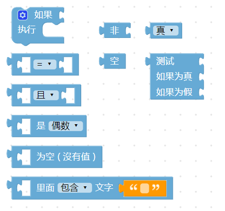

### 逻辑判断

「逻辑判断」积木预设有两种型态的组装「缺口」，在上方比较小的是「条件判断」，下方比较大的是「执行内容」，代表着*如果情况满足上方的条件判断( 判断返回值为「真」或「ture」 )，就会执行对应的内容*。

点选左上方的*蓝色小齿轮*，可以新增逻辑判断的条件，点一下可以打开，再点一下关闭。

逻辑条件判断有三种：*「如果」一定是在第一层，「否则如果」在中间，「否则」一定在最后*，「否则」的条件判断表示当「如果」和「否则如果」的条件都没有满足，就会执行「否则」的内容。

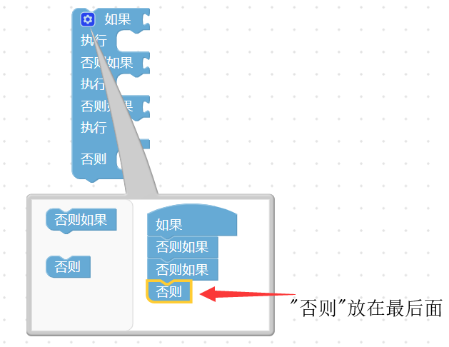

如果只有*两个条件*，例如非 A 即 B，只需使用「如果」和「否则」就可以，甚至可以不使用「否则」，这样在条件外就不会进行任何动作。

### 条件判断式

条件判断式主要会放在逻辑的「条件判断」缺口内，提供不同情境的逻辑判断，判断的条件主要分为：等于(=)、不等于(≠)、小于(<)、小于等于(≦ )、大于(>)、大于等于(≧)。

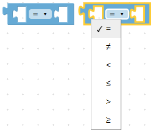

使用的方式是只要把条件判断式的积木，放到判断条件的缺口内即可。

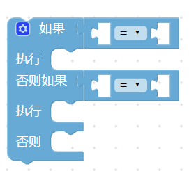

举例来说，可以先新增一个变量a 为0 到100 之间的随机整数，并让绿色小怪兽讲出数字，接着用逻辑判断，如果变量a 小于60 ( 返回判断为「true」 )，就让红色怪兽讲「不及格」，否则就讲「及格」，执行程序后就能看到对应的结果。

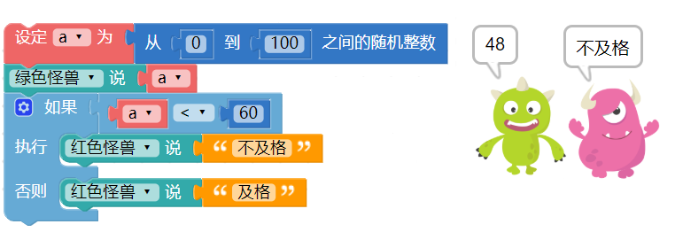

### 逻辑运算符

「逻辑运算符」积木为逻辑判断提供了更弹性的条件判断，当中包含了「*且*」与「*或*」，如果使用「且」，在两端判断的条件空格必须都满足时，才会执行动作，如果使用「或」，只要满足其中一个条件空格就会执行动作。

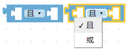

通常当逻辑判断里出现「如果否则」的时候，就会用到逻辑运算符，而逻辑运算符常常和条件判断的积木搭配使用。 ( 有时也会遇到只有「否则、如果」搭配逻辑运算符的情况 )

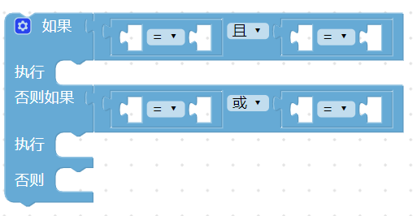

以刚刚的例子来说，可以增加到四个条件判断，分别是 0、1~59、60~99 和 100，当条件判断成立时，就会让小怪兽说出数字以及对应的文字。

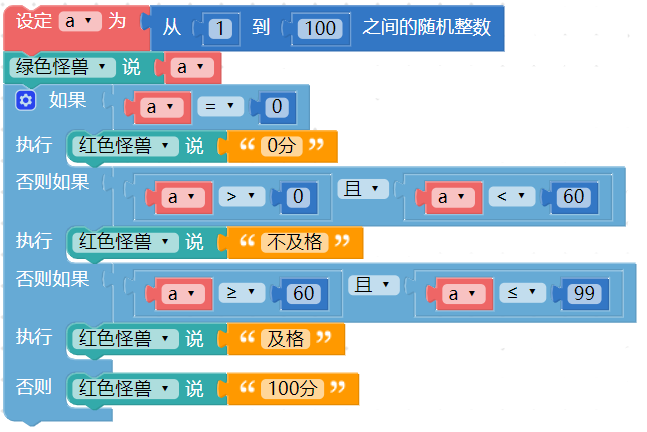

### 判断数字型态

「判断数字型态」积木可以帮助我们快速判断*奇数、偶数、整数、数字有小数点、文字和数组*。

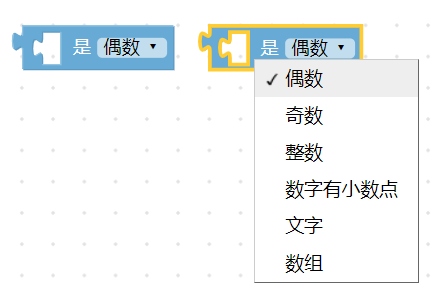

用法上只要直接放入条件判断的缺口内即可。

例如我们可以设定变量 a 为两个随机数相除，再通过小怪兽讲出整数或小数。 ( 除法的积木使用了「多行输入」，可以在积木上按右键选择多行输入，教学参考：[程序积木小技巧](../info/software.html#id7)

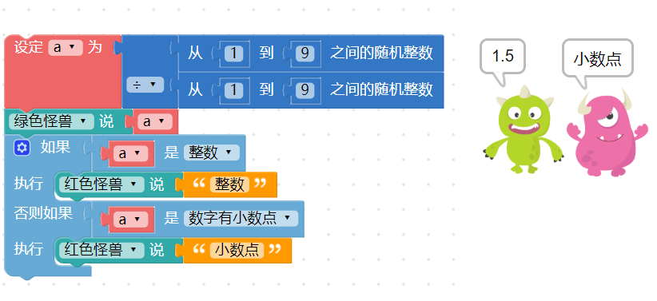

### 判断空值

「判断空值」积木主要是和「数组」积木搭配，*如果是空值返回 true，否则返回 false*。

会产生空值有几种情况：「*无文字、数字0、空数组、空值、false ( 假)、没有值的变量*」，如果满足这几种情况，就会返回true 。

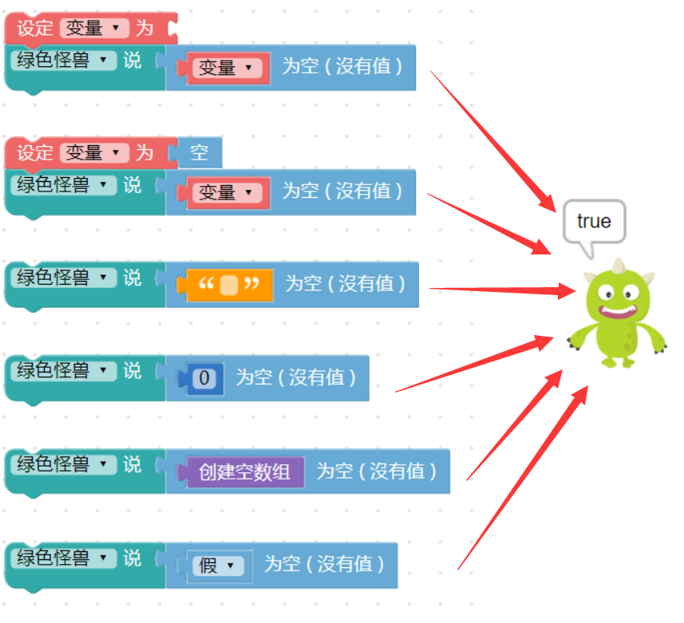

### 判断是否包含文字

「判断是否包含文字」积木可以检查某段文字内，是否*包含*了指定的文字或文字段落。

举例来说，如果检查「你是我的小呀小苹果」里面有包含「小苹果」，绿色怪兽就会说「找到小苹果了」，反之如果是「小柠檬」，红色怪兽就会说「没有小柠檬」。

### 非

「非」积木就如字面一样，表示「不是什么」，通常会和「真/假」或「空值」的积木搭配使用。

如果把积木接在「非」的积木后面，状态就会相反过来，例如空就会变成非空（不是空的）、真就会变假，假就会变真，依此类推。

### 真/假

「真/假」积木主要表示ture ( 真 ) 与false ( 假 ) 两个值，目的在让判断的时候在数字、文字之外，多一些判断的条件，同时也可以将ture 和false 提交给变量，在某些情境下也相当好用。

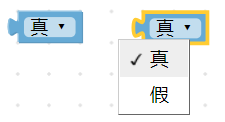

### 空

在写程序的时候，有时候会遇到某个变量或是某个数值变成空值 ( null )，这时就可以使用空值的积木判断，用法和「真/假」的用法类似。

### 三元逻辑运算符

「三元逻辑运算符」积木是针对只有「*两种条件*」的问题，并针对根据条件传回「两个运算式」的其中一个。

比如上面提到的及格与不及格的例子，因为只有两种条件，就可以通过三元逻辑运算符来轻松实现，且还可以使用比较少的积木完成同样的结果。

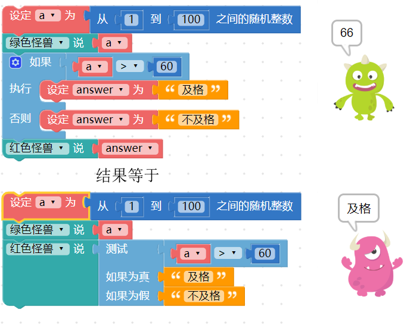
