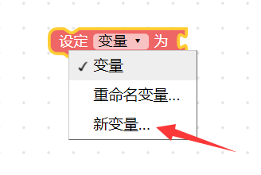
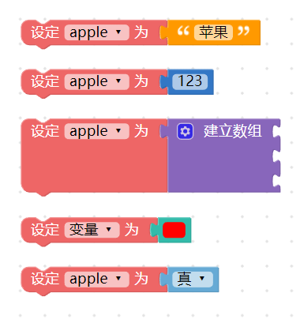
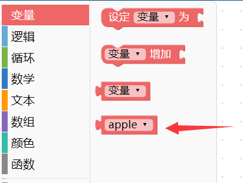
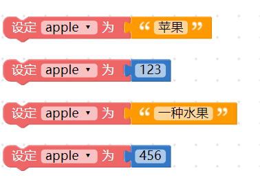
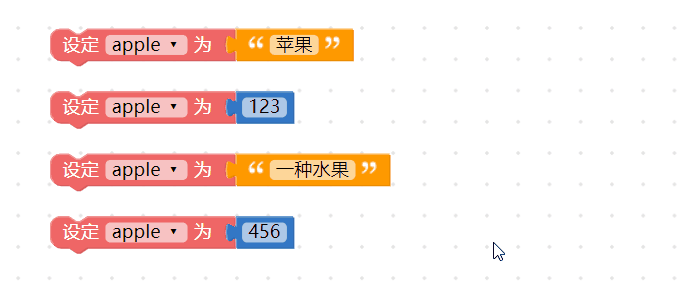
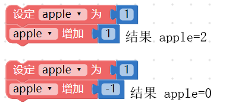
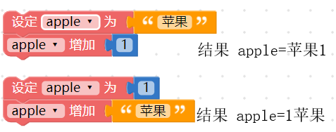
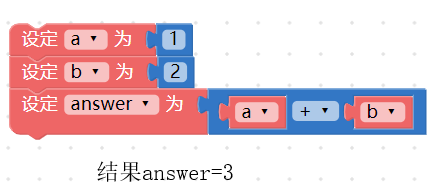

## 变量

变量，是所有程序都会用到的基本元素，使用前会赋予变量一个名称，接着就可以用这个变量来表示文字、数字、数组、颜色或逻辑。~~为什么要使用变量呢？因为在编辑程序往往会遇到许多「重复」的部分，~~如果用变量或函数装载这些重复的部分，就能够简单的进行一次新增、删除或修改动作。

举例来说，如果一段文章出现了五十次「A」，要把「A」修改为「B」，若不使用变量则得要手动修改五十次才办得到( 不考虑编辑软件的搜寻取代功能)，但如果今天我们用「变量 a 等于 A 」，在修改的时候只需做一次动作：「把变量 a 等于 B 」，就能把所有的「A」换成「B」，下方的教学内容将会深入介绍。

### 新增变量

使用变量的第一步，就是「新增一个变量」，打开编辑器，将「*设定变量为*」的积木拖拉到画面中，下拉选单选择「*新变量*」，点选后弹出对话视窗，输入新变量的名称即可新增一个变量。 ( 建议变量的命名尽可能以「英文 + 数字」为主 )

在新增的变量后方加上对应的值 ( 值可以是文字、数字、数组、颜色或逻辑 )，这个变量就等同于这个值，如果没有赋予值，这个变量就是空变量。

新增变量后，在左侧积木清单的变量目录下，也会看到新增的变量积木。

> 注意，如果在编辑画面里完全没有「设定变量为 XXX」的积木，积木清单里就不会看见 XXX 的变量积木。

### 设定变量

设定变量表示赋予变量一个值，使用方式和新增变量完全相同，由于程序语言有「*后面覆盖前面*」的特性，所以*如果变量名称相同，后面设定的值会覆盖掉前面设定的值* ，以下图的例子而言，变量apple 最后的值为456。

### 重新命名变量

区别于「新增变量」，重新命名变量可以将画面中所有的变量一次改名，例如画面里出现了四次 apple 的变量，通过重新命名，可以将四个 apple 变量名称全部换成 ball。

### 变量增加

变量增加表示「*让变量的值增加多少*」，假设原本变量的值为 1 ，使用变量增加 1 之后，这个变量就会加 1 变成 2 ，同理，如果使用变量增加 -1 ，那么这个变量就会加（-1）变成 0 。

注意，如果是不同类型的改变，例如原本的变量是文字「苹果」，却增加变量 字「1」，最后得到的结果是「苹果1」三个字，同理如果是变量是「1」，而改变文字「苹果」，得到的结果是「1苹果」。

### 使用变量

新增变量或设定变量完成后，就可以在编辑区中使用变量，以下图为例，先设定a 变量为1，b 变量为2，接着就能计算a + b 或a ÷ b 之类的数学运算，或进行判断a 和b 哪个值比较大的逻辑判断。当程序逻辑越来越复杂，就得通过的变量来操作。

