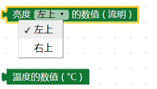
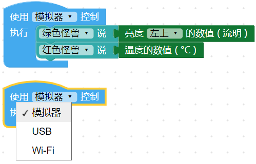
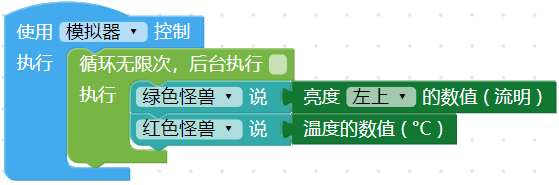
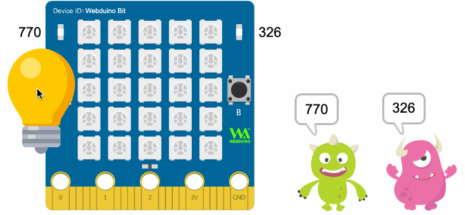
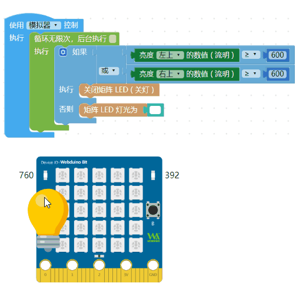
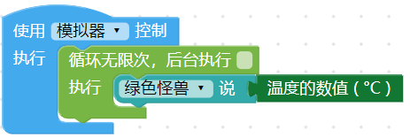
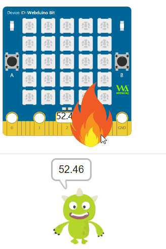
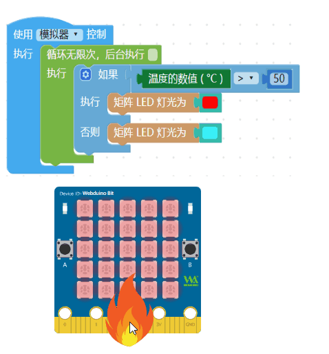

# 光线＆温度

开发板内有两个光敏传感器，以及一个热敏电阻，光敏传感器可以检测环境光线的流明数值，热敏电阻则可检测到小数点两位的温度变化，通过对光线和温度的检测，就能~~轻松地~~做出环境监控相关的场景应用。

## 积木清单

检测光线分别可以侦测左上和右上的亮度变化，检测的单位为流明，数值区间为 0~1000 的整数，温度侦测的单位为度 ℃，数值可到小数点两位。

``````



> *检测光线和温度积木必须搭配「开发板」积木*，选择模拟器，执行后可以使用鼠标拖拉模拟器的灯泡或火焰，选择USB，执行后会通过 USB 连线方式控制实体开发板，选择 Wi-Fi 则可通过 Wi-Fi 指定 Device ID 操控。
> - USB 控制模式为「安装版编辑器」所特有，请参考 [编辑器](../index.html#software)
> - Wi-Fi 模式需要开发板连接 Wi-Fi，请参考 [硬体开发板 ( 初始化设定 )](../info/setup.html)

``````



## 检测光线

「检测光线」积木使用时只会检测一次，搭配循环就能进行连续检测。

```
```



执行后，如果是使用模拟器，*画面里会出现「一个灯泡」图案*，拉动灯泡靠近画面里的光敏电阻，就能模拟光线的变化，如果是使用实体开发板，可用光线照射光敏电阻观察光线变化。




了解光线检测原理后，若搭配简单的逻辑判断，就能做出小夜灯的效果，以下图的例子而言，只要左边或右边的任何一个光敏传感器检测到亮度大于等于600 流明，就会熄灯，反之左右两边只要同时检测的数值小于600 流明就会亮白灯。

``````



## 检测温度

「检测温度」积木使用时只会检测一次，搭配循环就能进行连续检测。

``````



执行后，如果是使用模拟器，*画面里会出现「一个火焰」图案*，拉动灯泡靠近画面里的热敏电阻，就能模拟温度的变化，如果是使用实体开发板，可用手指按压热敏电阻、或用嘴对着热敏电阻吹气，就能观察温度变化。

```



了解温度侦测原理后，若搭配简单的逻辑判断，就能做出用颜色反映温度的效果，当温度大于等于 50 度就呈现红色，反之小于 40 度就是蓝色。

``````

