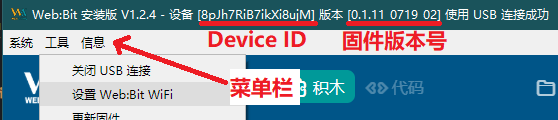

[TOC]

## 开发板的初始化

在往下使用开发板的 WIFI 联网功能之前，需要先进行初始化设置，通过本节的初始化设置可以让开发板可以连上网络（Internet），还可以够自定义开发板的 WIFI 显示名称和密码，更是可以通过 internet 进行远程更新（OTA）。

> 初始化后可以**通过「Wi-Fi」控制开发板**，如果只是使用「USB 控制」开发板，则可以跳过初始化设置。

### 初始化方法 1：使用安装版进行初始化

> 什么是安装版？点此查看 [Web:bit > 编辑器介绍 > 安装版]() 。

使用安装版按照下列步骤进行初始化设置。

#### 步骤 1、进入菜单 > 工具 > 设置 WIFI

将开发板通过 Micro USB 线连接电脑，打开安装版后，最上方会出现安装版的「版本号（如：V1.2.4）」以及「扫描 USB 设备」的提示，此时可以将开发板通过 USB 线连接电脑，让软件进行自动扫描并连接。

连接到开发板后，*上方会出现开发板的 Device ID 以及固件版本号*，接着按下键盘的*`Ctrl + W`* 开启菜单栏，用鼠标选择「*工具> 设置 Web:bit WiFi*」，开始进行初始化设置。

> *注意！没有出现如图连接情况，请使用 [Web:bit > 更新开发板固件 > 恢复出厂固件]()。

#### 步骤 2、设置 Wi-Fi SSID 与密码

点击设置 WiFi 后，会弹出一个对话窗，询问要连接的 WiFi 的名称和连接密码。 ( 这里就填入所在场所(例如：公司、学校或家里）的 Wi-Fi 帐号和密码 )

设置 WIFI 连接的 SSID ，存在配置则会读回，默认值是 `webduino.io` 。

设置 WIFI 连接的 密码 ，存在配置则会读回，默认值是 `webduino` 。

设置完成后，会弹出一个对话窗口，询问是否关闭 USB 连接，如果选择「确定」，开发板就会通过先前的 Wi-Fi 的帐号与密码，连接到指定的 Wi-Fi ，如果选择「取消」，就会关闭 Wi-Fi 连接功能，此时只能使用 USB 连接操作。

若选择关闭 USB 连线功能，开发板会进入 WIFI 连接模式。

此时开发板会重启并闪烁红灯，当 **红灯熄灭** 且 **绿灯亮起** 之后，表示 Web:Bit 开发板已经成功连接上 WiFi 。

- 若红灯持续闪烁或恒亮，请拔掉电源，重新操作步骤 1 与步骤 2 。

- 若红灯闪完后亮起「蓝灯」而不是绿灯，表示已有新版本可以进行下载更新，请参考[Web:bit > 更新开发板固件]() 。

### 初始化方法 2：WIFI 连接到开发板进行初始化

如果你想通过无线控制开发板，可以通过有 Wi-Fi 连接功能的笔记本电脑或移动设备，连接到开发板的 WIFI 热点进行初始化设置，相关步骤如下所示：

#### 步骤 1、接上电源，输入 WiFi 帐号密码连接

为开发板接上电源，上电后 开发板正面的 全彩 LED 矩阵会滚动显示一串文字( *默认是 bit 三个英文 + 四个数字* )，如下图的滚动显示的 bit1234 。

这串文字会在搜索的 WiFi 名称列表中，例如下图显示的 bit1234 ，在 WiFi 搜索界面中中就会看到 bit1234 的 WIFI 名称。

滚动结束后，由于开发板尚未初始化设置完成，也就无法连上局域网（内网），所以一开始 **会闪红灯，或者红灯恒亮** 。这时请准备一台具有 WiFi 功能的电脑、手提或移动设备，使用这台设备进行 Wi-Fi 搜索刚刚看到为「bitXXXX」的装置( 以上述的例子就是搜索 bit1234 )，找到该设备后，输入默认密码 **12345678** ，进行连接即可。

#### 步骤 2、设置 WiFi 帐号密码与显示名称

*确认连接成功*后，打开浏览器 ( 建议使用 Chrome )，地址栏输入 `192.168.4.1` 会进入到 Web:Bit 开发板的设置画面，画面中包含以下几种设置：

| 分类 | 设置 | 说明 |
| -------- | -------- | -------- |
| Wi-Fi     | SSID、PWD     | 至少填入一组 Wi-Fi 热点的 SSID（账号）和 PWD（密码），表示开发板要连接哪个 Wi-Fi 路由器，最多可填入三组，它会依据不同的环境自动切换。     |
| Device | Device ID | 每块开发板的唯一识别代码，目前版本预设都是短 ID。( 如果看到 ID 为 18 码的长 ID，可以点击 Shorten the ID 的按钮更换为短 ID，或进行远端更新自动更换为「短 ID」。 |
| Device | Device SSID、PWD | 可连接 WIFI 的设备在搜索 WiFi 中所显示的名称和密码，若不填写会自动产生 SSID 以及预设密码 12345678 。 |
| Device | MQTT Server | 开发板要连接的伺服器，预设 Global，中国地区请选择 China。 |
|Device	|Enable WiFi AP	|是否永远在 Wi-Fi 列表中看见开发板，预设持续显示，可选择三分钟后关闭 WI-FI 热点。|
|Info	|-	|开发板相关信息，包含网卡地址、Wi-Fi 连接情况以及版本号。

> 以上表格均可在下图找到对应设置项。

设置完成后按下 **SUBMIT** 保存，出现 **SAVE OK** 的字样表示设置成功。

此时开发板会重启并闪烁红灯，当 **红灯熄灭** 且 **绿灯亮起** 之后，表示 Web:Bit 开发板已经成功连接上 WiFi 。

- 若红灯持续闪烁或恒亮，请拔掉电源，重新操作步骤 1 与步骤 2 。

- 若红灯闪完后亮起「蓝灯」而不是绿灯，表示已有新版本可以进行下载更新，请参考[Web:bit > 更新开发板固件]() 。

