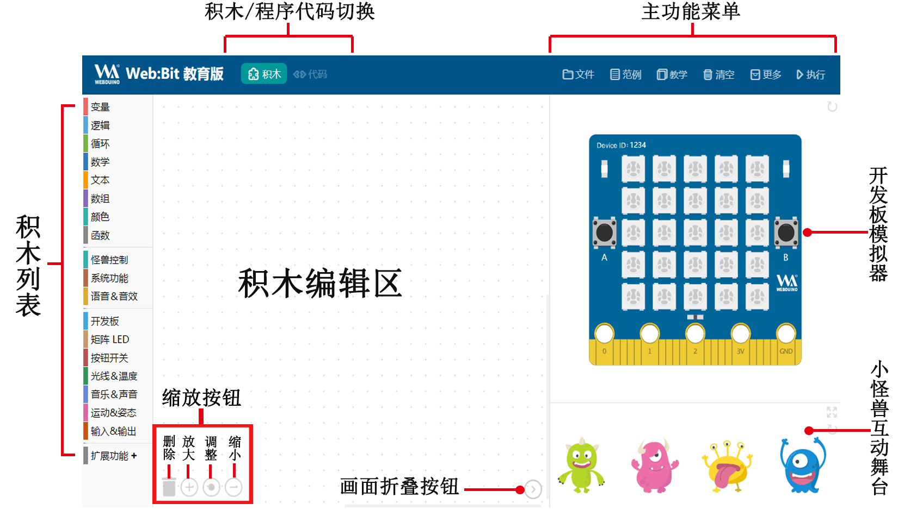
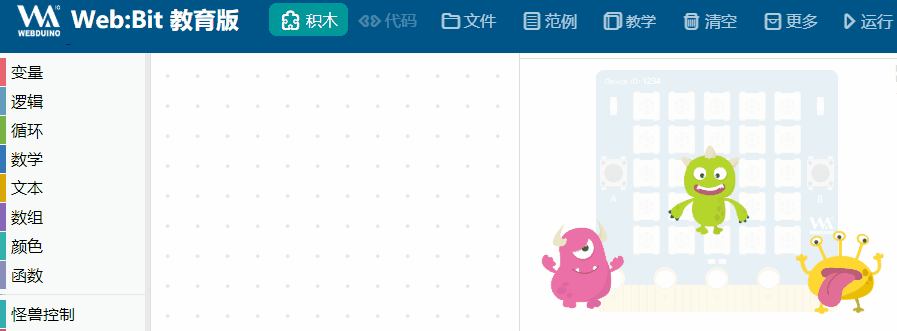
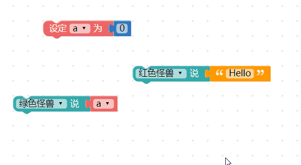
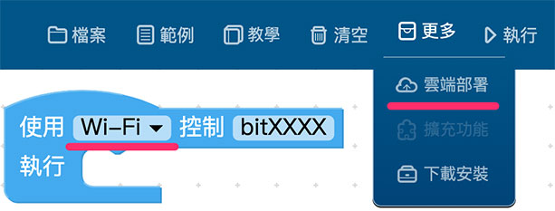
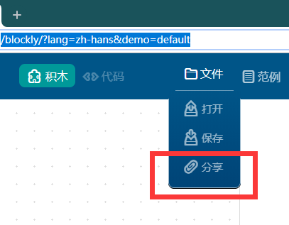
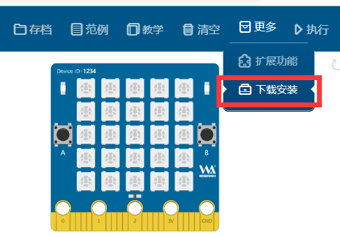
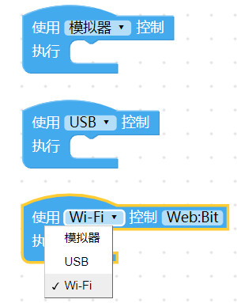
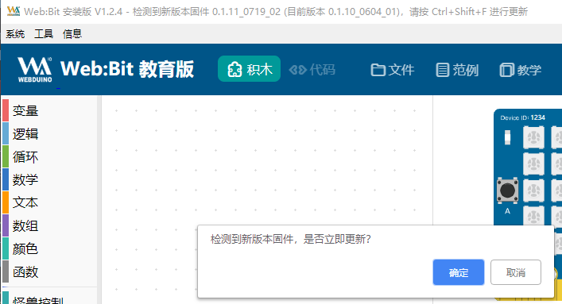
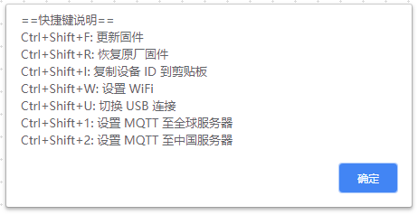

## 编辑器介绍

Web:Bit 编辑器是 Webduino 的程序积木和学习的编程软件，它是基于 Webduino Blockly 的操作方式，软件大幅简化了操作的步骤流程，并添加了**虚拟仿真开发板**、**小怪兽互动舞台**、**外接拓展硬件**等许多积木供你玩耍。不论是大朋友小朋友，都可以轻松的入门 Web:Bit 。

### 操作界面预览


#### 网页版

使用基于 Google Chrome 内核的浏览器即可体验积木编程，注意网页版暂不支持「USB 连接」开发板。

> 网页版链接：[webbit.webduino.io](https://webbit.webduino.io#_blank)
> 
#### 安装版

> 安装版下载：[WebBitSetup.zip](http://webduinoio.github.io/samples/content/bit-download/WebBitSetup.zip#_blank)
> 

**安裝版**目前只提供 Windows 7 以上的系统版本，不仅界面功能与网页版保持一致，还能够更方便的初始化设置和使用「USB 连接」开发板。

### 操作界面说明

编辑器的操作界面分成下列几类区域：

- **主功能菜单**：包含文件的打开与保存、范例和教学、清空、更多功能和执行。
- **积木/程序代码切换**：将写好的积木转换为标准 Javascript 代码。
- **积木列表**：包含基本功能、小怪兽控制、开发板控制和物联网拓展...等积木。
- **积木编辑区**：进行积木的逻辑组合，产生各种不同的场景应用。
- **开发板模拟器**：包含一块虚拟的开发板，可以模拟开发板的实际状况和应用。
- **小怪兽互动舞台**：包含四种不同造型和颜色的小怪兽，可以通过积木设定相关动作和互动。
- **缩放按钮**：能够快速缩放画面积木或删除积木。
- **画面折叠按钮**：可以折叠开发板模拟器和小怪兽互动区，让积木编辑区域放大或缩小。

````



### 积木编程是什么

对于第一次接触的人来说，可能不太清楚「积木编程」的由来，「积木」是翻译自「block」这个英文单词，其操作方式类似「组装积木」或「拼图」的概念，通过互相堆叠和搭配组合，就能判断不同的逻辑或依据指定的排列顺序，实现对应的动作。

````


编辑器是基于 Google 所开发出的 Blockly 图形化编程工具，下面我们演示一下使用进行编程的效果。



每块积木都有它对应的功能和用途，如果想了解该积木的使用方式，可以「**使用鼠标在指定的积木上单击右键**」，就能打开积木的功能列表，点击「**教学**」可以阅读该积木的教学文件，如果该积木有「**小工具**」，则可以点击小工具使用更多进阶功能。

````


### 积木使用小技巧

#### 小技巧 1、多行与单行输入

如果积木程序太长，可以用鼠标在积木上点击右键，且该积木支持多行输入，可以选择「**多行输入**」将积木由单行变成多行，也更方便阅读和编辑。

````


#### 小技巧 2、整理积木

在使用积木编程的时候，往往会遇到积木四面八方散落在积木编辑区上的状况，这时可以在编辑区域上点击右键，选择「**整理积木**」将积木排列整齐。

````



### 网页版独有功能

右上方的主功能菜单，包含编辑器的主要功能，但「**网页版**」和「**安装版**」编辑器的菜单略有不同。

#### 云端部署（繁体版本）

云端部署的功能可以帮助我们将编辑好的程序积木，部署到 Webduino 的云端服务器，如此一来就可以*在电脑关闭的状态下，继续执行对应的程序* ( *仍然需保持开发板正常连接网络* )，只要程序积木里**包含 Wi-Fi 连线 的开发板积木**，就能使用云端部署的功能。

> 注意，云端部署成功后，会在下列两种状况下停止：
> - *第一种，开发板网路断线超过 20 分钟。 *
> - *第二种，重新云端部署，或点击编辑器的「执行」按钮。 *



#### 分享链接

在网页版可以使用「**文件> 分享**」，分享可以帮助我们保存积木分享给他人，它会产生一段「**网址**」，下次再开启这个网址就可以载入分享的积木，但是安装版无法使用该功能。

````



在网页版主菜单的「**更多**」里面，包含「**下载安装**」的选项，点击后会下载安装版的压缩文件，解压缩安装就可以使用安装版。 ( 目前安装版编辑器仅支持 Windows )

````



### 安装版菜单说明

打开安装版之后按下电脑键盘的 *`Ctrl + W`* 可以打开工具列，工具列里分别有「*系统*」、「*工具*」和「*信息*」三个主要功能列表。


#### 系统 > 通过浏览器打开

点选「通过浏览器打开」，会自动打开电脑的 Chrome 浏览器并连接至[编辑器( 网页版)](https://webbit.webduino.io#_blank)，一般情况下这个功能不常用到，但如果使用安装版不支持的功能( 像「语音朗读」在安装版仅能发出英文语音)，就可以通过网页版来实现。

#### 工具 > 关闭 USB 连接

如果开发板使用 USB线 连接到电脑，安装版可以在没有 Wi-Fi 的状态下控制开发板，但此时开发板也将「关闭 Wi-Fi 连接功能」，如果要开启开发板的 Wi-Fi 连接功能，则需关闭安装版程序，或是点击「关闭USB连接」功能。

> *如果关闭 USB 连接，开发板就会采用 Wi-Fi 连接模式，反之开启 USB 连接就会关闭 Wi-Fi 连接功能*。

在操作上也可以通过下拉选单区使用 Wi-Fi 操控或 USB 连接操控。

> 详细操作方式会在[「开发板控制」]() 介绍使用方法。
> 

````



#### 工具 > 设置 Web:Bit WiFi

点击该选项之后，会要求我们输入 Wi-Fi 的 SSID 和 密码，这功能可以帮助我们将「WIFI 路由器」的 Wi-Fi 名称（SSID） 和 密码 设置到开发板中，不过如果没有 Wi-Fi 操控的需求，是不会用到该功能的。

> *特别提醒！如果无法使用该功能*，**需要恢复出厂固件**。
> 详细设定可以参考 [更新固件方法 1：使用安装版进行更新](setup.html#step1)
> 更新固件方式请参照[「开发板设置」>「初始化」]()
> 
````


#### 工具 > 更新固件

如果软件提示开发板有新版本的固件，可以点击该选项进行固件更新。

> *特别提醒！如果无法使用该功能*，**需要恢复出厂固件**。
> 更新固件方式请参照[「开发板设置」>「更新固件」]()
> 


````

````

#### 信息 > 版本、复制设备 ID、帮助

版本功能会显示目前的固件版本，复制设备 ID 可以将开发板的 Device ID 复制出来，而帮助会显示安装版支持的各种快捷键。

````




